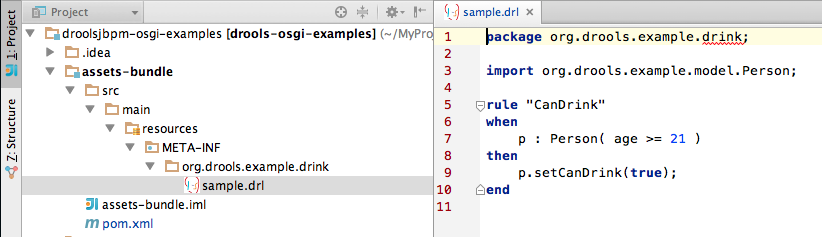
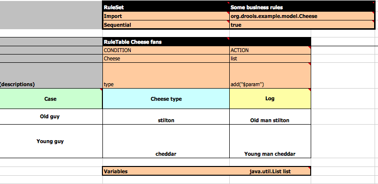
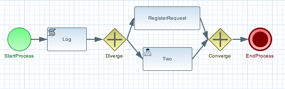
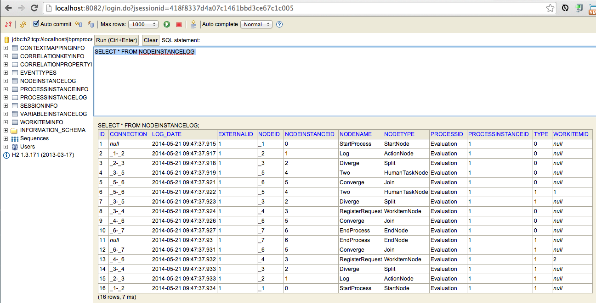

:source-highlighter: highlights
:data-uri:
:toc:

== Drools & jBPM examples for OSGi platforms (JBoss Fuse)

toc::[]

This project contains Drools & jBPM OSGi examples that you can deploy on :
RedHat supported release : https://www.jboss.org/products/fuse.html[RedHat JBoss Fuse 6.1]

== Download and compile the project

- In a Dos/Unix terminal, clone this git project and checkout out the tag version

  git clone https://github.com/cmoulliard/droolsjbpm-osgi-examples.git
  git checkout RH.6.0.3.ER8
  
or download the release available here : https://github.com/cmoulliard/droolsjbpm-osgi-examples/releases

- Move to that directory

  cd droolsjbpm-osgi-examples

- Compile it using `maven`

  mvn clean install
  
== Download and deploy on RedHat JBoss Fuse

- Open a browser at the following address : https://www.jboss.org/products/fuse.html
- Download `JBoss Fuse 6.1`
- Unzip it under your local temp directory *~/temp*
- Change to the JBoss Fuse bin directory

  cd ~/temp/jboss-fuse-6.1.0.redhat-379/bin

- Add the RedHat Maven Repo containing latest BRMS & BPMS builds (6.0.2.ER8, ...) to the config file
  containing the maven repositories that we scan when we deploy the bundles on JBoss Fuse

  vi etc/org.ops4j.pax.url.mvn.cfg
  # Append this line to the list of the repos

  org.ops4j.pax.url.mvn.repositories= \
      ..., \
      http://download.eng.bos.redhat.com/brewroot/repos/jb-ip-6-build/latest/maven/

- Start the Fuse console

  ./fuse

== Add Repositories of the modules

In the JBoss Fuse console, add the url pointing to the file containing the description of the Drools/jBPM OSGI modules

  features:addurl mvn:org.drools.example/features/1.0/xml/features

Now you are ready to start to play with different examples described hereafter !

== Drools OSGi Example

=== Simple Rule Example

To test the simple rule example which is a Drools example using a rule DRL

[source,java]
----
rule "CanDrink"
when
    p : Person( age >= 21 )
then
	p.setCanDrink(true);
end
----    

where we will check if a person can drink, we will deploy the module `simple-rule`. This module
which is a feature will install the code of the bundle `simple-rule` but also `drools core & compiler`
like `kie` project (api & internal)

  features:install simple-rule

After a few moment, you will see that the `bundle` has been installed and started as the Activator class will report the following message

    KieSession created.

corresponding to the KieSession created by Kie & Drools after discovering the META-INF/kmodule.xml file containing the location of the resources
to be loaded by Drools (Rule, ...).
This session is created as the start method of the bundle activator class contains the code to create a KieContainer, KieBaseConfiguration & KieBase

[source,java]
----
KieServices ks = KieServices.Factory.get();
KieBaseConfiguration kbaseConfig = ks.newKieBaseConfiguration(null, this.getClass().getClassLoader());
KieBase kbase = ks.newKieClasspathContainer().newKieBase(kbaseConfig);

this.ksession = kbase.newKieSession();
----

Next, 20 persons will be generated randomly by a function which, added to a KieSession and rule fired
to verify if they can Drink according to their age.

    Person Young Person aged of 18, can't go to the Bar
    Person Old Person aged of 21 , can go to the Bar
    Person Old Person aged of 21 , can go to the Bar
    Person Old Person aged of 21 , can go to the Bar
    Person Young Person aged of 18, can't go to the Bar
    Person Old Person aged of 21 , can go to the Bar
    Person Young Person aged of 18, can't go to the Bar
    Person Young Person aged of 18, can't go to the Bar
    Person Young Person aged of 18, can't go to the Bar
    Person Old Person aged of 21 , can go to the Bar
    Person Young Person aged of 18, can't go to the Bar
    Person Young Person aged of 18, can't go to the Bar
    Person Old Person aged of 21 , can go to the Bar
    Person Young Person aged of 18, can't go to the Bar
    Person Old Person aged of 21 , can go to the Bar
    Person Young Person aged of 18, can't go to the Bar
    Person Old Person aged of 21 , can go to the Bar
    Person Old Person aged of 21 , can go to the Bar
    Person Old Person aged of 21 , can go to the Bar
    Person Young Person aged of 18, can't go to the Bar

Remark : When you stop the bundle 'simple-rule', the Kie Session is stopped and this message appears in the console of jboss fuse

    KieSession disposed

=== Externalise the rules assets

One of the benefit of an OSGI platform is that the bundles (= jar file + META DATA defined in the MANIFEST.mf file) are isolated form
each other as they run within their own classloader. That means that we can split a Drools & Kie project into a collection of bundles: one containing
the logic and the Kie classes to build the container hosting the KieBase (= assets), KieSessions (= in cache memory of the facts/objects) while the
assets can be packaged in a separate bundle. This approach allows the business user to produce the jar containing the rules, decision tables, ...
according to a procedure (= release management) which is independent from the one followed by developer team to design/develop the project.
As the assets will be deployed in a separate bundle, they can be updated without changing the code of the project.

This demo which uses the same code as the example "Simple Rule Example" but it has been packaged into 2 bundles.

The assets

and the Kie

image:documentation/images/kie-bundle.png[]

The project can be deployed using this feature command

    features:install simple-import-rule

=== Simple XLS Decision Table with a Rule Example

As Drools supports to externalize rules in a XLS Decision Table, this example will demonstrate how such a project can be packaged
as an OSGi bundle. Compared to the previous example, the rule is not defined in a file where the extension ends with .drl but in a XLS file

The XLS Table contains a rule to checks Type of the Cheese. This file is located under this directory `resources/org.drools.example.cheese` and
the `resources/META-INF/kmodules.xml file contains the definition about the project to be scanned before to create the KieBase, KieSession

[source,xml]
----
<?xml version="1.0" encoding="UTF-8"?>
<kmodule xmlns="http://jboss.org/kie/6.0.0/kmodule">

    <kbase name="sampleKBase" packages="org.drools.example.cheese" default="true">
        <ksession name="sampleKSession" default="true" />
    </kbase>
</kmodule>
----

The code of the OSGI Bundle Activator used when the OSGI Container starts the bundle and calls the events `start`or `stop` are similar to what has been created
  for the `simple-rule`project

[source,java]
----
public void start(final BundleContext bc) throws Exception {

    KieServices ks = KieServices.Factory.get();
    KieBaseConfiguration kbaseConfig = ks.newKieBaseConfiguration(null, this.getClass().getClassLoader());
    Thread.currentThread().setContextClassLoader(getClass().getClassLoader());
    KieBase kbase = ks.newKieClasspathContainer().newKieBase(kbaseConfig);

    this.ksession = kbase.newKieSession();
    System.out.println("KieSession created.");

    for (int i = 0; i < 10; i++) {
        // Create a Cheese
        Cheese aCheese = EntityHelper.createCheese();
        ksession.insert(aCheese);

        // Fire the rules
        ksession.fireAllRules();

        // Check Cheese Price
        EntityHelper.cheesePrice(aCheese);
    }

    System.out.println("Cheese added and rules fired.");
}
----

To deploy this module on the container, use this fuse command which will install `decision-table` module and the example.
When the bundle will be started, this information will appear in the fuse Console

    JBossFuse@root> features:install simple-decisiontable-rule
    KieSession created.
    Cheese Stilton costs 10 EUR.
    Cheese Cheddar costs 50 EUR.
    Cheese Stilton costs 10 EUR.
    Cheese Stilton costs 10 EUR.
    Cheese Cheddar costs 50 EUR.
    Cheese Stilton costs 10 EUR.
    Cheese Cheddar costs 50 EUR.
    Cheese Stilton costs 10 EUR.
    Cheese Cheddar costs 50 EUR.
    Cheese Stilton costs 10 EUR.

=== External XLS Decision Table

As Rules will be designed by business analysts in a company, they will prefer to use a XLS Spreadsheet document that they will provide
 to the project (developer, ...) as artefact to be used by the application to calculate decision. In the previous example, the decision table
 was embedded, packaged into the jar file generated during the build of the application. While this approach is fine, it implies that the project must
 rebuild (regenerate a jar/zip file) every time we have a new update the decision table.
 This example allows you to externalize the location of the decision table. The only thing to be done is to change this variable in the code

[source,java]
----
package org.drools.example.osgi;
public class FetchExternalResourceOsgiActivator implements BundleActivator {
    private static final String EXTERNAL_XLS_RESOURCE = "file:///Users/chmoulli/MyProjects/droolsjbpm-osgi-examples/documentation/decision-table/cheeseDecisionTable.xls";
----

to point to your XLS file on the file system, before to build the project and deploy on it JBoss Fuse.

Project can be deployed using the following Karaf command :

    features:install fetch-external-resource

And after rules calculation, the following result will be displayed

    Cheese Cheddar costs 50 EUR.
    Cheese Cheddar costs 50 EUR.
    Cheese Stilton costs 10 EUR.
    Cheese Stilton costs 10 EUR.
    Cheese Cheddar costs 50 EUR.
    Cheese Cheddar costs 50 EUR.
    Cheese Cheddar costs 50 EUR.
    Cheese Cheddar costs 50 EUR.
    Cheese Cheddar costs 50 EUR.
    Cheese Cheddar costs 50 EUR.
    Cheese added and rules fired.

For later update of the XLS file, the bundle used for this example must be restarted to create new Session and load new Rules definition

    osgi:restart ID_OF_THE_BUNDLE

=== Simple rule using Declarative Service

Instead of implementing the BundleActivator interface in our code, the service required to call the events (start/stop) of the bundle (managed by the OSGI container)
can be managed using http://wiki.osgi.org/wiki/Declarative_Services[OSGI Declarative Service]. The DS will take care to retrieve from the OSGI Registry the interface exposed with this
name ("org.osgi.framework.BundleActivator").
By adding the following annotations to the class, the service will be retrieved when the bundle will be started and the methods (start/deactivate) called by the DS container
when the proxy object will be created with the classloader of the bundle.

[source, java]
----
    @Component(name = "org.osgi.framework.BundleActivator")
    public class CanDrinkRuleOsgiDeclarativeService {

        private KieSession ksession;

        @Activate
        public void start(final BundleContext bc) throws Exception { ...}

        @Deactivate
        public void stop(final BundleContext bc) throws Exception { ... }

    }
----

Like the simple rule example the project can be deployed with the help of the features provisioning mechanism.

    features:addurl mvn:org.drools.example/features/1.0/xml/features
    features:install simple-rule-inject-ds

=== Simple rule using CDI & Weld

BundleActivator like also Spring Dynamic Module, Blueprint and Declarative Service are great and interesting technologies to start/stop your bundle, inject the services or design your bundle as a component but they use http://en.wikipedia.org/wiki/OSGi[OSGI] that maybe your are not familiar with as
a Java or JavaEE developer. In this case, you can also turn on your project into a CDI Beans project and use http://weld.cdi-spec.org/[Context & Dependency Injection]
to manage the lifecycle of your bundle and inject the *KieSession* created based on your *Kmodule.xml* using annotations.

To use Weld 2.x and CDI 1.1, it is required to add this https://ops4j1.jira.com/wiki/display/PAXCDI/Requirements+and+Capabilities[OSGI requirement capability] to your bundle as this
property will be used by the OSGI Container to *register* your bundle to the CDI Service managed by https://ops4j1.jira.com/wiki/display/PAXCDI/Pax+CDI[OPS4J Pax CDI] which implement
the specification http://blog.osgi.org/2012/05/osgicdi-integration-rfp-available-for.html[OSGI CDI].

[source, xml]
----
<Require-Capability>
    osgi.extender; filter:="(osgi.extender=pax.cdi)"
</Require-Capability>
----

The java class looks like any CDI Bean class where a scope has been defined (@ApplicationScope) and dependencies injected
*@Inject @Kession* to retrieve from the CDI Context, the object KSession created based on Kmodule.xml definition. The trick to link
the lifecycle of the bundle (start/stop events) with the OSGI CDI Service is to use the *@Observes* http://docs.jboss.org/cdi/spec/1.0/html/events.html#observermethods[annotation]
and the *ContainerInitialized event*.

[source, java]
----
import org.kie.api.cdi.KSession;
import org.ops4j.pax.cdi.api.ContainerInitialized;

import javax.annotation.PreDestroy;
import javax.enterprise.context.ApplicationScoped;
import javax.enterprise.event.Observes;
import javax.inject.Inject;

@ApplicationScoped
public class CanDrinkRuleOsgiCdiWeld {

    @Inject
    @KSession("sampleKSession")
    private KieSession ksession;

    public void onStartup(@Observes ContainerInitialized event) {

        KieServices ks = KieServices.Factory.get();
        KieContainer kcont = ks.newKieClasspathContainer(getClass().getClassLoader());
        KieBase kbase = kcont.getKieBase("sampleKBase");

        this.ksession = kbase.newKieSession();
        System.out.println("KieSession created.");

        for (int i = 0; i < 20; i++) {
            // Create a Person
            Person aPerson = PersonHelper.createPerson();
            ksession.insert(aPerson);

            // Fire the rules
            ksession.fireAllRules();

            // Check if it can drink
            PersonHelper.canDrink(aPerson);
        }
    }

    @PreDestroy
    public void onClose() {
        if (this.ksession != null) {
            this.ksession.dispose();
            System.out.println("KieSession disposed.");
        }
    }
----

To deploy this project on JBoss Fuse, use this feature command which will deploy your drools cdi bundle but also the Weld CDI 1.1 container
, the OSGI CDI service managing the lifecyle of the CDI Container when the bundle start/stop

    features:install simple-cdi

== jBPM OSGi Example

=== Simple Process

jbpmn process is also supported and can be deployed too on JBoss Fuse container. Like the Drools Simple Rule Example, you should install a feature
which will install the bundles required (jbpm, Human-task, ...) and finally the example

    features:install simple-process

The process is simple and start by logging information that process has been initiated before to diverge, register a request and finally converge at the end

To configure the runtime manage with the bpmn process file, you should add assets using a `ResourceFactory.newClassPathResource` with the package name containing it

[source,java]
----
RuntimeEnvironment environment = RuntimeEnvironmentBuilder.getEmpty()
        .addAsset(ResourceFactory.newClassPathResource(process,getClass().getClassLoader()), ResourceType.BPMN2)
        .get();
return RuntimeManagerFactory.Factory.get().newSingletonRuntimeManager(environment);

The parameters used by the business process like also the tasks are configured like that

runtimeEngine = runtimeManager.getRuntimeEngine(EmptyContext.get());
ksession = runtimeEngine.getKieSession();

LOG.info("Register tasks");
ksession.getWorkItemManager().registerWorkItemHandler("Human Task", new SystemOutWorkItemHandler());
ksession.getWorkItemManager().registerWorkItemHandler("Register Request", new SystemOutWorkItemHandler());

Map<String, Object> params = new HashMap<String, Object>();
params.put("employee", "UserId-12345");

LOG.info("Start process Evaluation (bpmn2)");
ProcessInstance processInstance = ksession.startProcess("Evaluation", params);
LOG.info("Stated completed");
----

=== jBPM Process with JPA persistence

One of the key benefit of a BPM engine is that when a process will be started we can persist the state changes when the steps/nodes defined
in a BPMN process are reached. The purpose of this example is to design the project using the *jBPM Persistence JPA* module and to manage such
changes using http://hibernate.org/[Hibernate ORM Technology] with a Database http://www.h2database.com/html/main.html[H2].
Spring will be used to manage the creation of the JPA Container and load from the Hibernate mapping ORM files the classes used by the JPA layer
to insert/update records in the database.

To configure the jBPM runtime manager to use the persistent layer, the Kbase configuration must include the bean jpa-persistence with the references to
the TransactionManager *JpaTransactionManager* and the JPA Container *LocalContainerEntityManagerFactoryBean*. The LocalContainerEntityManager
is configured with a Datasource and the persistent Unit Name containing the information about the Transaction Management (LOCAL_RESOURCE or JTA),
mapping classes / tables ...

[source,xml]
----
<?xml version="1.0" encoding="UTF-8"?>
<beans xmlns="http://www.springframework.org/schema/beans"
       xmlns:xsi="http://www.w3.org/2001/XMLSchema-instance"
       xmlns:kie="http://drools.org/schema/kie-spring"
       xsi:schemaLocation="
       http://www.springframework.org/schema/beans http://www.springframework.org/schema/beans/spring-beans-3.0.xsd
       http://drools.org/schema/kie-spring http://drools.org/schema/kie-spring.xsd">

    <kie:kmodule id="kModule">
        <kie:kbase name="kPersistence">
            <kie:ksession name="kSession" type="stateful">
            <kie:processEventListener ref="audit-listener"/>
            <kie:processEventListener ref="log-listener"/>
            <kie:configuration>
                <kie:jpa-persistence>
                    <kie:transaction-manager ref="txManager"/>
                    <kie:entity-manager-factory ref="myEmf"/>
                </kie:jpa-persistence>
            </kie:configuration>
            </kie:ksession>
        </kie:kbase>
    </kie:kmodule>

    <bean id="jbpm-ds" class="org.springframework.jdbc.datasource.DriverManagerDataSource">
        <property name="driverClassName" value="org.h2.Driver"/>
        <property name="url" value="jdbc:h2:tcp://localhost/jbpmprocess"/>
        <property name="username" value="sa"/>
        <property name="password" value=""/>
    </bean>

    <bean id="myEmf" class="org.springframework.orm.jpa.LocalContainerEntityManagerFactoryBean">
        <property name="dataSource" ref="jbpm-ds"/>
        <property name="persistenceUnitName" value="org.jbpm.persistence.jpa.local"/>
    </bean>

    <bean id="txManager" class="org.springframework.orm.jpa.JpaTransactionManager">
        <property name="entityManagerFactory" ref="myEmf"/>
    </bean>

</beans>
----

The KieRuntime will use the following bean definition to register the TxManager and the JPA Container

[source,xml]
----
    <kie:environment id="env">
        <kie:entity-manager-factory ref="myEmf"/>
        <kie:transaction-manager ref="txManager"/>
    </kie:environment>
----

To enable the logging / audit of the processes started and nodes triggered we have added some Process listeners to the config

[source,xml]
----
    <kie:kmodule id="kModule">
        <kie:kbase name="kPersistence">
            <kie:ksession name="kSession" type="stateful">
            <kie:processEventListener ref="audit-listener"/>
            <kie:processEventListener ref="log-listener"/>
            ...

    <bean id="log-listener" class="org.jbpm.osgi.persistent.example.LoggingProcessEventListener"/>
    <bean id="audit-listener" class="org.jbpm.process.audit.AuditLoggerFactory"
          factory-method="newJPAInstance">
        <constructor-arg ref="env"/>
    </bean>
----

- Before to install the example, http://www.h2database.com/html/download.html[H2] database must be installed on your machine and started. Download the
database, unzip the content in directory and open a terminal. Move to the directory h2/bin and and launch H2 using the shell or bat script *./h2.sh*
- Next the project can be deployed in Boss Fuse using these instructions

    features:addurl mvn:org.drools.example/features/1.0/xml/features
    features:install jbpm-spring-persistent

When the process will be triggered, the logging process listener will collect the information and log them on the console

----
JBossFuse:karaf@root> LoggingProcessEventListener :: beforeVariableChanged
LoggingProcessEventListener :: afterVariableChanged
LoggingProcessEventListener :: beforeProcessStarted
LoggingProcessEventListener :: beforeNodeTriggered
LoggingProcessEventListener :: beforeNodeLeft
LoggingProcessEventListener :: beforeNodeTriggered
Processing evaluation for employee UserId-12345
LoggingProcessEventListener :: beforeNodeLeft
LoggingProcessEventListener :: beforeNodeTriggered
LoggingProcessEventListener :: beforeNodeLeft
LoggingProcessEventListener :: beforeNodeTriggered
Executing work item WorkItem 1 [name=Human Task, state=0, processInstanceId=1, parameters{NodeName=Two}]
LoggingProcessEventListener :: beforeNodeLeft
LoggingProcessEventListener :: beforeNodeTriggered
LoggingProcessEventListener :: afterNodeTriggered
LoggingProcessEventListener :: afterNodeLeft
LoggingProcessEventListener :: afterNodeTriggered
LoggingProcessEventListener :: afterNodeLeft
LoggingProcessEventListener :: beforeNodeLeft
LoggingProcessEventListener :: beforeNodeTriggered
Executing work item WorkItem 2 [name=RegisterRequest, state=0, processInstanceId=1, parameters{employeeId=UserId-12345}]
----

Similarly, info can retrieved using the H2 web console (*http://localhost:8082/*) when you will be connected using the following parameters :

- Driver Class : org.h2.Driver
- JDBC Url : jdbc:h2:tcp://localhost/jbpmprocess
- User name : sa
- Password :

- Click on the table *nodesintancelog* and run the SQL query generated (SELECT * FROM NODEINSTANCELOG) to consult info audited by the runtime manager

== Integration with Camel Example

The Drools/jBPM has developed different kie modules that you can use to integrate this technology with Apache Camel to collect
the information needed to prepare the facts/objects that we will next inserted into the KieSessions.

=== Kie Spring with Camel & Drools

This example combines the http://camel.apache.org[Camel Java Integration framework] with Drools and Spring (IoC framework) to insert the facts/objects into a KieSession
created and managed by camel. The objects created (= Person) whenever they are inserted in the KieSession will be

To run the project on JBoss Fuse, simply run this features:install command to deploy the bundles. After being deployed the bundle containing the
camel routes definition will be started and the camel timer component will fire events every 10s to request to create a Person object or Cheese object as we have 2 camel routes.

[source, xml]
----
<route trace="false" id="testRoute">
  <description>Example route that will regularly create a Person with a random age and verify their age
  </description>
  <from uri="timer:testRoute?period=10s"/>
  <bean method="createTestPerson" ref="personHelper"/>
  <to uri="kie:ksession1?action=insertBody" id="AgeVerification"/>
  <choice>
    <when id="CanDrink">
      <simple>${body.canDrink}</simple>
      <log logName="Bar" message="Person ${body.name} can go to the bar"/>
    </when>
    <otherwise>
      <log logName="Home" message="Person ${body.name} is staying home"/>
    </otherwise>
  </choice>
</route>
----

One camel route is used by Drools and the other by Drools DecisionTable.

The object created (= fact) is inserted into the KieSession used by Drools and when this is done the rules will be fired automatically.
To play with the project, use the following *features:install* command to deploy the bundles on JBoss Fuse.

    features:install drools-decisiontable-kie-spring-camel

=== Kie Blueprint with Camel & Drools

Same example as described before but instead of Spring Dynamic Module project, we will setup the project using the http://www.ibm.com/developerworks/library/os-osgiblueprint/[OSGI Blueprint container]
to instantiate the beans required to start the CamelContext containing the camel routes like also the beans handling the business logic (PersonHelper, CheeseHelper, ...).

    features:install drools-decisiontable-kie-blueprint-camel

Enjoy it !

== Shortcut to play with the different scenario

To play with the different examples and redeploy the bundles in JBoss Fuse every time, follow these steps

- Start Fuse with the clean option to remove previously installed bundles and start the server with the features defined by default under the file
etc/org.apache.karaf.features.cfg (see featuresBoot variable)

  ./fuse clean

- Add the RedHat Maven Repo containing latest BRMS & BPMS builds (6.0.2.ER3, ...)

  vi etc/org.ops4j.pax.url.mvn.cfg
  # Append this line to the list of the repos

  org.ops4j.pax.url.mvn.repositories= \
      ..., \
      http://download.eng.bos.redhat.com/brewroot/repos/jb-ip-6-build/latest/maven/

- Install the features repo and the corresponding features

1. Drools project (kie + rules) started using BundleActivator

  features:addurl mvn:org.drools.example/features/1.0/xml/features
  features:install simple-rule

2. Drools project (kie + rules) started using OSGI Declarative Service

  features:addurl mvn:org.drools.example/features/1.0/xml/features
  features:install simple-rule-inject-ds

3. Drools project (kie + rules) started using CDI and Weld

  features:addurl mvn:org.drools.example/features/1.0/xml/features
  features:install simple-cdi

4. Idem as scenario 1. but rules are packaged in a separate jar/bundle

  features:addurl mvn:org.drools.example/features/1.0/xml/features
  features:install simple-import-rule

5. Drools Decision Table (kie + rules defined in a spreadsheet) started using BundleActivator

  features:addurl mvn:org.drools.example/features/1.0/xml/features
  features:install simple-decisiontable-rule

6. Drools Decision Table (kie + rules defined in a spreadsheet ) started using BundleActivator

  features:addurl mvn:org.drools.example/features/1.0/xml/features
  features:install fetch-external-resource

7. jBPM process

  features:addurl mvn:org.drools.example/features/1.0/xml/features
  features:install simple-process

8. jBPM process using persistence & JPA

  features:addurl mvn:org.drools.example/features/1.0/xml/features
  features:install jbpm-spring-persistent

9. Spring project (Kie Spring) starting Camel Routes firing Drools rules

  features:addurl mvn:org.drools.example/features/1.0/xml/features
  features:install drools-decisiontable-kie-spring-camel

10. Aries Blueprint project (Kie Aries Blueprint) starting Camel Routes firing Drools rules

  features:addurl mvn:org.drools.example/features/1.0/xml/features
  features:install drools-decisiontable-kie-blueprint-camel
